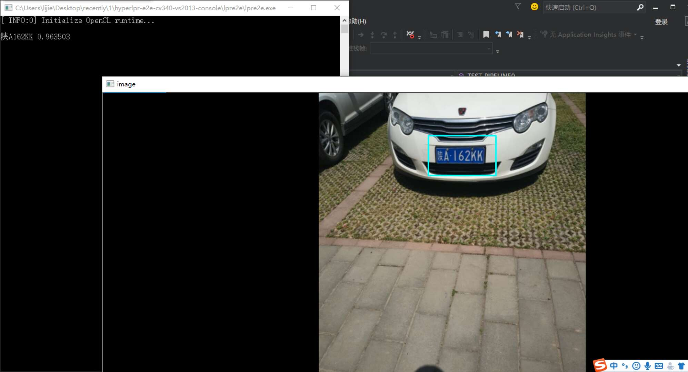

智能交通车辆监控
===

## 📖项目简介
---
|类别|内容|
|------|------|
|目的|一款软件，实现违章抓拍、自动识别车牌、统计车流量信息、区分车道等功能|
|应用的技术|图像处理、机器学习、深度学习|  
|使用的手段|车牌识别、车辆检测、图片抓拍、违章判断、车流量统计|
|使用的工具|雷达、监控摄像头、抓拍摄像头|
|呈现形式|做成一款PC端软件，将测得的数据在界面上进行展示，并存档|
|优势|安装维护成本低|
|特色|准确率高，出现误报的情况少，系统稳定可靠|

## 🍉已完成
---
|已完成|可展示形式|
|-|-|
|车牌识别|可以识别图片内的车牌|
|车辆检测|可检测并追踪视频中车辆|

1. 车牌识别 

### 可识别和待支持的车牌的类型

- [x] 单行蓝牌
- [x] 单行黄牌
- [x] 新能源车牌
- [x] 白色警用车牌
- [x] 使馆/港澳车牌
- [x] 教练车牌
- [x] 武警车牌
- [ ] 民航车牌
- [ ] 双层黄牌
- [ ] 双层武警
- [ ] 双层军牌
- [ ] 双层农用车牌
- [ ] 双层个性化车牌

2. 车辆检测

（稍后放上图片和视频）

## 🐳还需要做的事
---
|list|content|
|-|-|
|道路检测|看了一些代码，好像也比较成熟了[示例](https://github.com/ljgithub669/CarND-Advanced-Lane-Lines)|
|代码功能的优化|目前代码主要应用别人的，自己还不会改动，后期需要多费些功夫|
|代码接口问题|对代码还不熟悉，未能灵活使用接口|
|后端和前端的统一|把后端功能在软件上进行呈现|

## 🚀截止日期
---
2019年6月进行结题答辩